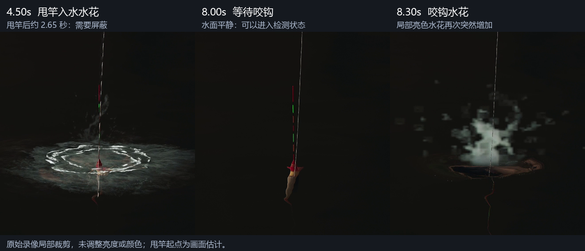

# 钓鱼录像分析：只检测水花是否可行

结论：在这段固定视角、右键放大的录像中，只检测中央局部水花并配合时间控制可行；初版不需要跟踪鱼浮或部署神经网络。若从甩竿动作开始计时，2 秒太短，3 秒仍可能遇到入水水花尾段。建议以“3.5 秒屏蔽”作为简单初始参数，或“先屏蔽 3 秒，再确认水面连续平静 0.2 秒才开始监测”。

## 数据与测量范围

- 文件：`D:\GameVideos\deltaForceRecord\15623878227063700672\record\record20260912-233726.mp4`
- 1728 × 1080，60 fps，4143 帧，时长 69.05 秒。
- 6 次甩竿及随后咬钩、提竿，包含一轮鱼饵从 1 到 0 再恢复 5。
- 对全部视频帧提取了局部图像指标；结合逐段抽帧检查标注甩竿、咬钩和换饵。
- 视频没有鼠标按键日志。甩竿起点是鱼竿动作的人工画面估计，约有 ±0.05～0.1 秒误差，不能当作精确点击时刻。
- 当前结论来自第二段放大录像；第一段未放大录像尚未纳入验证。

## 为什么 3 秒仍可能早

下表中“水花开始/结束”指局部亮色像素数超过/回落到本次选定阈值的时间，不是所有水纹完全消失的时间。

| 轮次 | 甩竿起点估计 | 入水水花超过阈值的区间 | 咬钩水花开始超过阈值 | 从甩竿到入水水花尾段 |
|---|---:|---:|---:|---:|
| 1 | 1.85 s | 4.18～4.98 s | 8.18 s | 3.13 s |
| 2 | 11.20 s | 13.53～14.32 s | 22.30 s | 3.12 s |
| 3 | 24.65 s | 26.93～27.72 s | 32.82 s | 3.07 s |
| 4 | 35.20 s | 37.52～38.27 s | 43.87 s | 3.07 s |
| 5 | 46.20 s | 48.47～49.28 s | 54.08 s | 3.08 s |
| 6 | 58.70 s | 60.98～61.82 s | 67.05 s | 3.12 s |

本段入水水花约在甩竿开始后 2.28～2.33 秒达到检测阈值，并持续约 0.75～0.83 秒。第一轮咬钩约在甩竿后 6.33 秒，六轮均在 3.5 秒之后，因而这段样本使用 3.5 秒屏蔽未漏掉咬钩。这不证明其他场景不存在更早的咬钩。

## 只使用水花指标的离线对比

使用 OpenCV 的 HSV 颜色空间，在固定区域 `(x=680, y=300, width=360, height=350)` 内统计 `V >= 80 且 S <= 100` 的像素数。超过 1000 像素且连续两帧满足条件则触发一次。每轮触发后停止检测，下一轮从新的甩竿起点重新计时。这个回放没有使用鱼浮颜色、位置或消失条件。

| 开始监测的条件 | 匹配录像咬钩 | 提前误触发 |
|---|---:|---:|
| 甩竿后 2 秒 | 0 / 6 | 6 次入水水花 |
| 甩竿后 3 秒 | 0 / 6 | 6 次入水水花尾段 |
| 甩竿后 3.5 秒 | 6 / 6 | 0 |
| 甩竿后 4 秒 | 6 / 6 | 0 |
| 甩竿后 3 秒，再等连续 0.2 秒低于 500 像素 | 6 / 6 | 0 |

这是以人工标注的六个甩竿起点进行的离线回放。阈值与区域是在同一段录像上选择的，属于样本内验证，不是独立测试集准确率，也不证明实服自动钓鱼成功率。提高水花阈值可能让 3 秒方案避开尾段，但在其他水花较弱的场景可能漏检，不能从这段视频推导通用阈值。

原始回放结果见 `timing_comparison.json`，逐帧指标见 `measurements/metrics.csv`。回放脚本为项目根目录的 `replay_splash_timing.py`。

## 换饵与其他动作时间

- 本段右下角实际显示的是 `005/∞` 到 `001/∞`；1 和 0 为红色。数字位置固定，适合小范围模板匹配。
- 第五次提竿动作约从 54.4 秒开始，随后数字变为 0；约 58.5 秒画面已恢复 5，约 58.7 秒开始下一轮甩竿。
- 这次“提竿到下一轮甩竿”的观察间隔约 4.3 秒。前四个普通间隔约 2.0～2.6 秒，包含玩家实际等待与反应，不能据此断定游戏强制冷却时长。
- 实际脚本应在换饵完成、下一轮甩竿真正发生后，再启动水花屏蔽计时。不能在上一轮提竿时提前启动。
- 视频可见提竿时镜头退出放大；再次甩竿后重新进入放大。没有输入日志，无法仅靠录像判断退出放大是游戏自动行为还是右键操作。
- 咬钩水花后很快出现提竿动作，但这段录像不能证明游戏允许的最晚提竿时刻。两帧确认只是本次离线检测设定。

## 建议的第一版流程

1. 确认鱼饵与鱼竿已就绪，执行甩竿并记录本轮起点。
2. 镜头进入放大状态，屏蔽 3 秒。
3. 等中央检测区亮色水花低于阈值并持续 0.2 秒，才进入监测。
4. 检测到新的明显水花连续两帧，产生一次提竿信号，并立即锁住本轮检测。
5. 普通轮等待收竿完成；最后一饵进入换饵等待。识别鱼饵恢复与动作就绪后开始下一轮。

这套方法仍只需要水花检测与少量状态控制。固定裁剪区域只对当前分辨率、视角和落点有效；换分辨率或水域后需要重新校准。若一直未出现平静状态或长时间没有咬钩，应超时暂停，避免循环失去同步。

当前产物是录像分析和离线回放，没有启动实时截图或向游戏发送任何按键。
